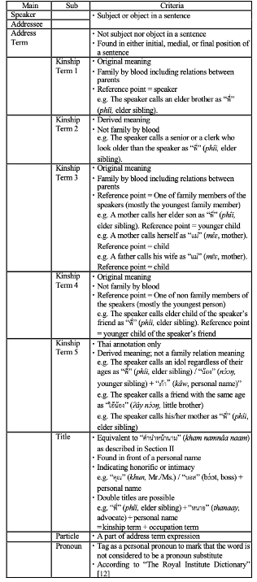

# BKD-Prosub

__BKD-Prosub is a Thai Pronoun Substitute and Address Term Annotated corpus in the work of BKD (Bangkok Data) corpus collection.__

## Abstract

A pronoun substitute is a word or a phrase that is used to refer to the speaker or the addressee of a conversation instead of using a personal pronoun.

Pronoun substitutes are frequently and naturally used in Thai conversation. Pronoun substitutes and address terms are important linguistic cues that help us understand the intended referent of a noun (phrase) in a sentence, such as the word “girl” in “That’s a heavy load, girl,” which indicates that the addressee is someone possessing properties described by the word "girl." In natural language processing tasks such as machine translation and dialogue systems, accurate anaphora resolution is crucial for generating coherent and meaningful responses. By leveraging these linguistic cues, language models can improve their ability to accurately identify the intended referent of a pronoun and generate more accurate and contextually appropriate responses.

The development of a corpus with pronoun substitute and address term annotations aims at exploring the actual use of these linguistic elements in dialogues. To create the corpus, dialogue sentences were extracted from a collection of the scripts of popular TV dramas and novels.  These sources were chosen in order to provide a comprehensive overview of conversation settings. One key feature of the corpus is the inclusion of a detailed definition of kinship relations. This was done to gain a better understanding of the usage and meaning of kinship terms in dialogues. To ensure the accuracy of the corpus annotations, each sentence was annotated by two annotators, and the results were compared. This approach helps to minimize errors and personal biases, leading to a high-quality corpus that accurately reflects the usage of pronoun substitutes and address terms in natural language conversations. The comparison of annotations can also highlight any discrepancies, which can then be resolved through further discussion and collaboration between the annotators. This rigorous process helps to ensure that the corpus is a reliable and trustworthy resource. The resulting corpus will provide a wealth of information about these linguistic elements and the way in which they are used in real-life dialogues, which makes the present corpus a useful resource for researchers in this field.

## Tagset and Criteria for Annotation

## Thai Conversational Text Collection for Pronoun Substitute and Address Term Annotation

## Format
The annotation is provided in a tab-delimited text format.  The first line is a header explaining the content in each column.

## Acknowledgement
This work was supported by the Thailand Science Research and Innovation Fundamental Fund, Contract Number TUFF19/2564 and TUFF24/2565, and by JSPS KAKENHI Grant Number JP20H01255. We would like to extend our appreciation to Dr. Sorarat Jirabawornvisut, Khunying Vinita Diteeyont (aka V. Vinichaikul), and Tipthida Satthathip for the valuable contributions of their writings for this study. Additionally, we would like to acknowledge the publishers, Amarin Printing and Publishing PCL. and BEC World PCL., who have graciously allowed us to use their works in our research.

## References
- [[1]	V. Sornlertlamvanich, et al. “Collaborative Collection of Multilingual Pronoun Substitutes and Address Terms,” In Proc. 7th Int. Conf. on Business and Industrial Research (ICBIR2022), Bangkok, Thailand, May 19-20, 2022, pp. 36-40.](https://www.virach.com/_files/ugd/cdb1d4_35a863a70b2f4ee2b9b4c02b46fd29e7.pdf)
- [[2]	S. Wittayapanyanon. “A Review of Studies of Pronoun Substitute and Address Term,” In Southeast Asian Studies Tokyo University of Foreign Studies, No. 26, Dec 2020, pp.1-23.](http://repository.tufs.ac.jp/handle/10108/95672)

## License

[Apache 2.0](./LICENSE)
